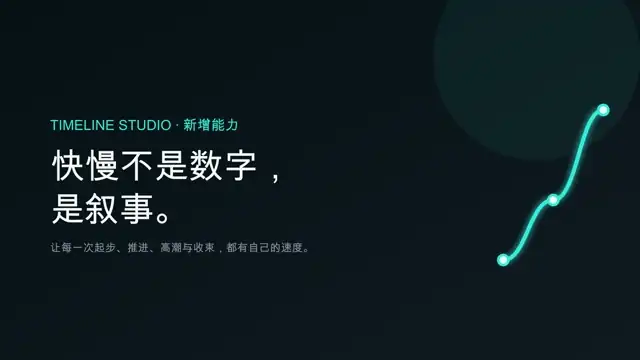
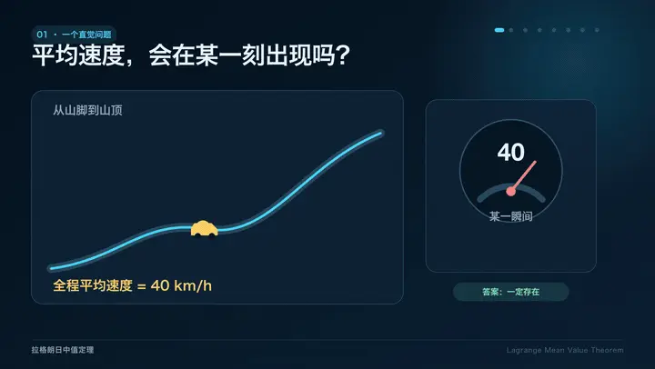

# Timeline Studio Skill Cases

> Reproducible AI video-editing workflows, result cases, and evaluation criteria.

English · [简体中文](README.zh-CN.md) · [Contributing](CONTRIBUTING.md)

 

> These Skills are executed by [Timeline Studio — the open-source AI video editor](https://github.com/MartinDelophy/ai-video-editor).
>
> Want to run any case? [Install Timeline Studio](https://github.com/MartinDelophy/ai-video-editor) first.

One prompt. One result. One editable `.timeline` project.

## What this repository proves

- **Reproducible workflows:** each case preserves its one-line prompt, original video when available, result video, and editable project.
- **Visible results:** compact previews make the outcome understandable before the implementation details.
- **Verifiable evaluation:** compare prompt adherence and reference similarity, inspect audiovisual quality, and open the `.timeline` to examine the edit structure.

## Case 001 · Original → Result

> Recreate this reference as a Kiana video with extremely similar framing and editing, using multiple battlesuits and HD CG footage.

[Original video](cases/001-kiana-multi-battlesuit-remake/assets/reference.mp4) → [Result video](cases/001-kiana-multi-battlesuit-remake/assets/result.mp4) · [Editable `.timeline`](cases/001-kiana-multi-battlesuit-remake/assets/kiana-multi-battlesuit-remake.timeline) · [Open case](cases/001-kiana-multi-battlesuit-remake/README.md)

## Case 002 · Prompt → Result

> Create a promotional video for Claude Fable 5 using `edit-timeline-studio`.

[Result video](cases/002-claude-fable-5-promo/assets/result.mp4) · [Editable `.timeline`](cases/002-claude-fable-5-promo/assets/claude-fable-5-promo.timeline) · [Open case](cases/002-claude-fable-5-promo/README.md)

## Case 003 · Chinese → English

> Convert the Claude Fable 5 promo entirely to English, using an English-only voiceover.

[Chinese original](cases/002-claude-fable-5-promo/assets/result.mp4) → [English result](cases/003-claude-fable-5-english-localization/assets/result.mp4) · [Editable `.timeline`](cases/003-claude-fable-5-english-localization/assets/claude-fable-5-english.timeline) · [Open case](cases/003-claude-fable-5-english-localization/README.md)

## Case 004 · Prompt → Narrative Promo

> Create a promotional video around this idea: creating content is easier than ever, and manual editing is becoming the old way.

[Result video](cases/004-everyone-can-create-narrative/assets/result.mp4) · [Editable `.timeline`](cases/004-everyone-can-create-narrative/assets/everyone-can-create.timeline) · [Open case](cases/004-everyone-can-create-narrative/README.md)

## Case 005 · Prompt → Cosmic Science Video

> Create a stunning, easy-to-understand cosmic science video using web-sourced footage.

[Result video](cases/005-cosmic-scale-science/assets/result.mp4) · [Editable `.timeline`](cases/005-cosmic-scale-science/assets/cosmic-scale.timeline) · [Open case](cases/005-cosmic-scale-science/README.md)

## Case 006 · Original → Cat Highlight Result

> Use this reference to turn the cat footage into a matching highlight edit: keep the original BGM, remove the final two-second Douyin voice, and recreate its repetition and dramatic tension.

[Original video](cases/006-cat-highlight-replication/assets/reference.mp4) → [Result video](cases/006-cat-highlight-replication/assets/result.mp4) · [Editable `.timeline`](cases/006-cat-highlight-replication/assets/cat-highlight-replication.timeline) · [Open case](cases/006-cat-highlight-replication/README.md)

## Case 007 · Prompt → Motivational Short

> I am going through a low point in life. Use `edit-timeline-studio` and suitable web-sourced footage to create a motivational video that encourages me.

[Result video](cases/007-reclaim-yourself/assets/result.mp4) · [Editable `.timeline`](cases/007-reclaim-yourself/assets/reclaim-yourself.timeline) · [Open case](cases/007-reclaim-yourself/README.md)

## Case 008 · Prompt → English Motivational Video

> Create an uplifting English motivational video with the latest `edit-timeline-studio`, using suitable web-sourced footage.

[Result video](cases/008-rise-anyway/assets/result.mp4) · [Editable `.timeline`](cases/008-rise-anyway/assets/rise-anyway.timeline) · [Open case](cases/008-rise-anyway/README.md)

## Case 009 · Prompt → Speed Curve Feature Demo

> Use `edit-timeline-studio` to introduce the newly added visual speed-curve capability and deliver the final video.

[Result video](cases/009-speed-curve-feature-intro/assets/result.mp4) · [Editable `.timeline`](cases/009-speed-curve-feature-intro/assets/speed-curve-feature-intro.timeline) · [Open case](cases/009-speed-curve-feature-intro/README.md)

## Case 010 · Prompt → Brand Promo

> Create a promotional video for Minute Maid Pulpy Orange with `edit-timeline-studio`, using Qinglan Mandarin voiceover and a warm piano score.

[Result video](cases/010-orange-pulp-promo/assets/result.mp4) · [Editable `.timeline`](cases/010-orange-pulp-promo/assets/orange-pulp-promo.timeline) · [Open case](cases/010-orange-pulp-promo/README.md)

## Case 011 · Prompt → Mathematics Explainer

> Use the latest `edit-timeline-studio` skill to create a mathematical explainer video about the Lagrange Mean Value Theorem.

[Result video](cases/011-lagrange-mean-value-theorem/assets/result.mp4) · [Editable `.timeline`](cases/011-lagrange-mean-value-theorem/assets/lagrange-mean-value-theorem.timeline) · [Open case](cases/011-lagrange-mean-value-theorem/README.md)

## The two formats

| Type | What visitors see |
| --- | --- |
| **Comparison** | Original video → one-line prompt → result video |
| **Standalone** | One-line prompt → result video |

Every case also includes its `.timeline` project so the result is backed by an editable artifact, not just a claim.

## Add a case

Use the [minimal case template](cases/_template/README.md) and follow the [contribution guide](CONTRIBUTING.md). Browse all cases in the [case gallery](cases/README.md).

## Rights

This is an unofficial, non-commercial skill demonstration. Third-party media remains the property of its respective owners and is excluded from the repository's [CC BY 4.0 license](LICENSE).
