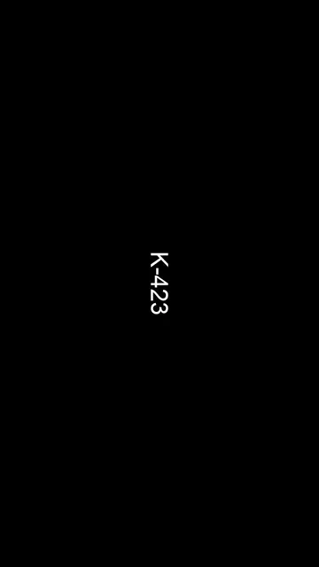

# Awesome Timeline Studio Skills

> Real production cases, reusable prompts, and verifiable results created with Timeline Studio skills.

English · [简体中文](README.zh-CN.md)

[Case Gallery](cases/README.md) · [Skill Workflow](docs/workflow.md) · [Contributing](CONTRIBUTING.md)

  

## Featured case

[](cases/001-kiana-multi-battlesuit-remake/README.md)

### Case 001 — Kiana multi-battlesuit reference remake

The `edit-timeline-studio` skill reverse-engineered a 26.47-second reference, sourced traceable HD footage, rebuilt its rotated-landscape-in-portrait visual grammar, assembled multiple Kiana battlesuits, and refined character identity through user feedback.

| Skill | Core capabilities | Result | Prompt pack |
| --- | --- | --- | --- |
| `edit-timeline-studio` | Reference analysis, lawful footage sourcing, shot-function mapping, beat-accurate assembly, iterative visual QA, technical validation | [View case](cases/001-kiana-multi-battlesuit-remake/README.md) · [Watch MP4](cases/001-kiana-multi-battlesuit-remake/assets/result.mp4) · [Download `.timeline`](cases/001-kiana-multi-battlesuit-remake/assets/kiana-multi-battlesuit-remake.timeline) | [Original brief](cases/001-kiana-multi-battlesuit-remake/prompts/00-original-brief.md) · [Skill production brief](cases/001-kiana-multi-battlesuit-remake/prompts/01-production-brief.md) |

## Project vision

This repository treats an Agent Skill as a production system rather than a short instruction file. Each case connects four things:

```text
User intent → Skill workflow → Skill-derived production prompt → Verifiable output
```

The goal is to make skill capability visible and reusable:

- **Output first** — every featured case leads with the artifact, not a feature claim.
- **Prompt as production code** — both the original request and the structured brief produced through skill use are preserved.
- **Evidence over adjectives** — frame count, duration, dimensions, audio checks, sources, and known limitations are recorded.
- **Iteration is part of the case** — user corrections and the resulting revisions are documented, not hidden.
- **Reusable structure** — future sessions can be added without redesigning the repository.

## Skill capability index

| Skill | Case count | Demonstrated capability | Cases |
| --- | ---: | --- | --- |
| `edit-timeline-studio` | 1 | Frame-aware reference recreation, web-footage research, multi-source editing, feedback-driven revision, delivery QA | [Case 001](cases/001-kiana-multi-battlesuit-remake/README.md) |

Future skills and mixed-skill workflows will be added here as their sessions are completed.

## Case anatomy

Every case should include:

1. **Result** — an inline preview plus a full-quality or repository-safe output.
2. **Session context** — session ID, original request, material constraints, and meaningful user corrections.
3. **Skills used** — the named skill and the production capabilities it demonstrated.
4. **Prompt pack** — the verbatim user brief and a reusable production prompt synthesized through the skill workflow.
5. **Process** — major decisions, iterations, and rejected approaches.
6. **Verification** — media metadata, technical checks, and acceptance evidence.
7. **Provenance and limits** — source links, rights notes, missing artifacts, and honest boundaries.

Browse the [full case gallery](cases/README.md) or use the [case template](cases/_template/README.md).

## How to use this repository

1. Start with a case whose output resembles your goal.
2. Review the capability table and production decisions.
3. Copy the case's skill-derived prompt and replace its variables.
4. Invoke the named skill with your own authorized material.
5. Validate the result using the case's acceptance criteria.

## Repository structure

```text
timeline-studio-handbook/
├── README.md                         # English-first gallery home
├── README.zh-CN.md                   # Complete Simplified Chinese mirror
├── cases/
│   ├── README.md                     # Case index
│   ├── _template/                    # Template for future sessions
│   └── 001-kiana-multi-battlesuit-remake/
│       ├── README.md                 # Case study
│       ├── prompts/                  # Original and skill-derived prompts
│       └── assets/                   # Preview, contact sheet, and result
├── docs/                             # Shared workflows
└── CONTRIBUTING.md                   # Contribution rules
```

## Roadmap

- [x] Convert the handbook into an output-first skill case gallery
- [x] Add the first real Codex session and prompt pack
- [x] Add repository-safe visual and video previews
- [ ] Add more `edit-timeline-studio` workflows
- [ ] Add mixed-skill production cases
- [ ] Add filters by skill, media type, and capability
- [ ] Add an optional visual gallery website when the case count justifies it

## Notes and disclaimer

This is an unofficial personal-practice repository and is not affiliated with the Timeline Studio maintainers, HoYoverse, or miHoYo. Product behavior can change; refer to the [Timeline Studio repository](https://github.com/chatman-media/timeline-studio) for current information.

Case media may contain third-party material. It is included for non-commercial skill demonstration and methodology study with source attribution; ownership remains with the respective rights holders. Do not assume that case media is licensed for commercial reuse.

## License

Original documentation and prompt structures are licensed under [CC BY 4.0](LICENSE) unless otherwise noted. Third-party media and referenced source material are excluded from that license.
