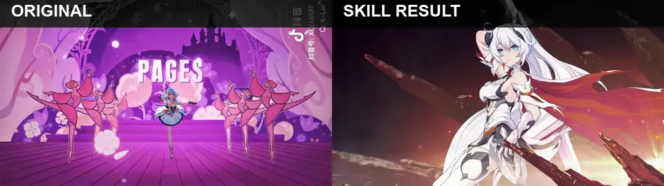
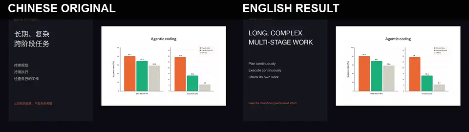
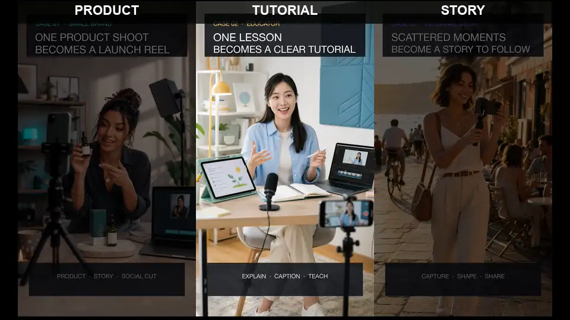
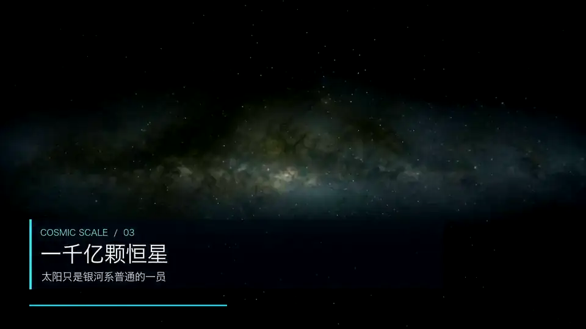
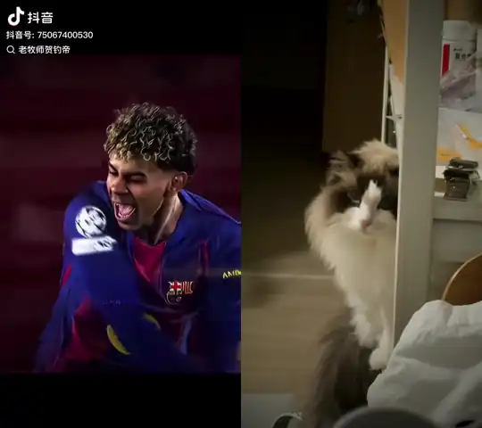
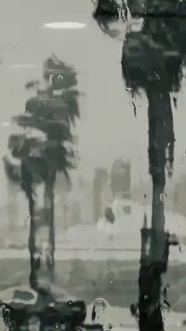
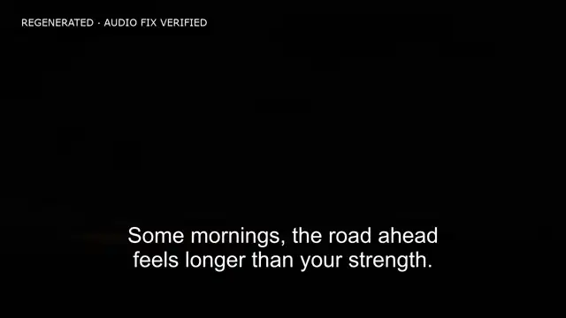

# Timeline Studio Skill 案例

> 可复现的 AI 视频剪辑工作流、效果案例与评测标准。

[English](README.md) · 简体中文 · [参与贡献](CONTRIBUTING.zh-CN.md)

 

> 这些 Skills 由 [Timeline Studio — 开源 AI 视频编辑器](https://github.com/MartinDelophy/ai-video-editor) 执行。
>
> 想运行任何案例？请先[安装 Timeline Studio](https://github.com/MartinDelophy/ai-video-editor)。

一句话提示词，一个结果，一个可编辑的 `.timeline` 工程。

## 这个仓库证明什么

- **工作流可复现：** 每个案例都保留一句话提示词、原视频（如有）、结果视频与可编辑工程。
- **效果可直接查看：** 紧凑的预览让路人在阅读实现细节前就能看懂结果。
- **评测可验证：** 可以比较提示词完成度与参考视频相似度、检查视听质量，并打开 `.timeline` 查看剪辑结构。

## Case 001 · 原视频 → 结果

> 参考这个视频复刻一条琪亚娜视频，画面位置和剪辑玩法要极度相似，并使用多套装甲与高清 CG 素材。

[原视频](cases/001-kiana-multi-battlesuit-remake/assets/reference.mp4) → [结果视频](cases/001-kiana-multi-battlesuit-remake/assets/result.mp4) · [可编辑 `.timeline`](cases/001-kiana-multi-battlesuit-remake/assets/kiana-multi-battlesuit-remake.timeline) · [查看案例](cases/001-kiana-multi-battlesuit-remake/README.zh-CN.md)

## Case 002 · 提示词 → 结果

> 帮我做一期 Claude Fable 5 的宣传视频，使用 `edit-timeline-studio` 来做。

[结果视频](cases/002-claude-fable-5-promo/assets/result.mp4) · [可编辑 `.timeline`](cases/002-claude-fable-5-promo/assets/claude-fable-5-promo.timeline) · [查看案例](cases/002-claude-fable-5-promo/README.zh-CN.md)

## Case 003 · 中文 → 英文

> 把 Claude Fable 5 宣传片完整转换成英文，并使用纯英文配音。

[中文原版](cases/002-claude-fable-5-promo/assets/result.mp4) → [英文结果](cases/003-claude-fable-5-english-localization/assets/result.mp4) · [可编辑 `.timeline`](cases/003-claude-fable-5-english-localization/assets/claude-fable-5-english.timeline) · [查看案例](cases/003-claude-fable-5-english-localization/README.zh-CN.md)

## Case 004 · 提示词 → 叙事推广片

> 围绕“内容创作从未如此简单，手动剪辑正在成为旧方式”制作一条推广视频。

[结果视频](cases/004-everyone-can-create-narrative/assets/result.mp4) · [可编辑 `.timeline`](cases/004-everyone-can-create-narrative/assets/everyone-can-create.timeline) · [查看案例](cases/004-everyone-can-create-narrative/README.zh-CN.md)

## Case 005 · 提示词 → 宇宙科普片

> 使用网络素材制作一条效果惊艳、简单易懂的宇宙知识科普视频。

[结果视频](cases/005-cosmic-scale-science/assets/result.mp4) · [可编辑 `.timeline`](cases/005-cosmic-scale-science/assets/cosmic-scale.timeline) · [查看案例](cases/005-cosmic-scale-science/README.zh-CN.md)

## Case 006 · 原视频 → 小猫高光结果

> 参考这个视频，把这些小猫素材剪成同类高光效果：保留原生 BGM，去掉最后 2 秒抖音语音，并复刻其中的重复与张力感。

[原视频](cases/006-cat-highlight-replication/assets/reference.mp4) → [结果视频](cases/006-cat-highlight-replication/assets/result.mp4) · [可编辑 `.timeline`](cases/006-cat-highlight-replication/assets/cat-highlight-replication.timeline) · [查看案例](cases/006-cat-highlight-replication/README.zh-CN.md)

## Case 007 · 提示词 → 励志短片

> 我正处在人生低谷，请使用 `edit-timeline-studio` 和合适的网络素材，做一条能鼓舞我的励志视频。

[结果视频](cases/007-reclaim-yourself/assets/result.mp4) · [可编辑 `.timeline`](cases/007-reclaim-yourself/assets/reclaim-yourself.timeline) · [查看案例](cases/007-reclaim-yourself/README.zh-CN.md)

## Case 008 · 提示词 → 英文励志视频

> 使用最新版 `edit-timeline-studio` 和合适的网络素材，制作一条以鼓舞为主的英文励志视频。

[结果视频](cases/008-rise-anyway/assets/result.mp4) · [可编辑 `.timeline`](cases/008-rise-anyway/assets/rise-anyway.timeline) · [查看案例](cases/008-rise-anyway/README.zh-CN.md)

## 两种展示类型

| 类型 | 路人会看到什么 |
| --- | --- |
| **对比型** | 原视频 → 一句话提示词 → 结果视频 |
| **生成型** | 一句话提示词 → 结果视频 |

每个案例都附带 `.timeline` 工程，证明结果来自一个可继续编辑的真实项目，而不只是一段宣传文字。

## 添加案例

使用[极简案例模板](cases/_template/README.zh-CN.md)，并阅读[贡献指南](CONTRIBUTING.zh-CN.md)。全部案例见[案例列表](cases/README.zh-CN.md)。

## 权利说明

本仓库是非官方、非商业的 Skill 能力展示。第三方素材权利归各自权利人所有，不包含在仓库的 [CC BY 4.0 许可](LICENSE)中。
