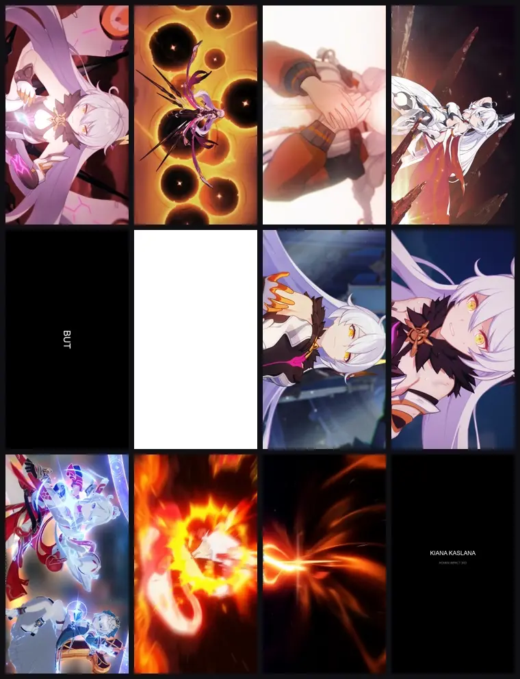

# Case 001: Kiana Multi-Battlesuit Reference Remake

English · [简体中文](README.zh-CN.md)

> Rebuild the editing grammar of a 26.47-second reference with multiple Kiana battlesuits, HD CG footage, retained authorized audio, and a rotated landscape composition inside a portrait container.

[](assets/result.mp4)

[Watch the repository-safe MP4](assets/result.mp4) · [Download the `.timeline` evidence project](assets/kiana-multi-battlesuit-remake.timeline) · [Original brief](prompts/00-original-brief.md) · [Reusable production brief](prompts/01-production-brief.md)

## Case metadata

| Field | Value |
| --- | --- |
| Codex session | `019fda07-8303-7423-bc7a-474d4e86fc31` |
| Skill | `edit-timeline-studio` |
| Task type | Editing-style reference replication |
| Subject | Kiana Kaslana, multiple battlesuits |
| Final version | v2.4 |
| Output | 720×1280, 30 fps, 794 frames, 26.466667 s |
| Audio | Original authorized track retained without re-encoding in the source final |
| Repository preview | 3.3 MB H.264/AAC MP4 plus animated WebP |
| Editable evidence | 3.2 MB `.timeline`, 27 cut-aligned editable clips |

## Original user intent

The user asked to test `edit-timeline-studio` against a local reference video and recreate its visual placement and editing behavior with Kiana footage found online. During the run, the user clarified four invariants:

- keep the original audio;
- retain a 720×1280 portrait container with the landscape picture rotated sideways;
- use multiple Kiana battlesuits rather than one source PV;
- accept only HD, CG-like footage without low-resolution gameplay UI.

The exact initial request and meaningful clarifications are preserved in the [original brief](prompts/00-original-brief.md).

## Skill capabilities demonstrated

### 1. Reference-video analysis

The skill identified the reference as a short-form template built from word-timed text, repeated character shots, black-frame punctuation, flash/blur impacts, and a denser second-half climax. It resolved the unusual viewing geometry as a portrait file containing a rotated landscape composition, with the final card returning upright.

### 2. Constraint-aware footage sourcing

The run did not treat “publicly viewable” as “downloadable and reusable.” It rejected platform-only offline downloads, low-resolution GIFs, HUD-heavy gameplay, and third-party downloader bypasses. The search moved toward first-party miHoYo media and original files exposed by an official community wiki, recording quality and source fit before editing.

### 3. Shot-function mapping

Instead of concatenating complete PVs, footage was assigned to dramatic roles and reference beats:

```text
Herrscher of the Void → Void Drifter / Meteoric phase →
Herrscher of Flamescion → Ba-Dum! Fiery Wishing Star
```

Battlesuit changes landed on the reference's black cards, white flashes, structural turns, and climax rather than arbitrary source boundaries.

### 4. Feedback-driven visual QA

The user caught problems that a container-level media check could not detect. The skill localized and corrected them without changing the global timing:

| Revision | User feedback | Change |
| --- | --- | --- |
| v2.1 | Theresa appeared around 16.20–17.07 s | Replaced the entire 26-frame beat with a Kiana solo close-up |
| v2.2 | Theresa also appeared near the opening | Replaced 34 opening frames and removed embedded subtitle area |
| v2.3 | Two later character illustrations repeated | Kept the first illustration; replaced only the two repeats with distinct 3D Kiana shots |
| v2.4 | Theresa remained around 14.00–14.87 s | Replaced another 26-frame beat with a Herrscher of the Void solo shot |

### 5. Technical verification

The final source render was decoded and checked against the requested invariants:

| Check | Result |
| --- | --- |
| Dimensions | 720×1280 |
| Frame rate | 30 fps |
| Frame count | 794 |
| Duration | 26.466667 s |
| Video decode | Completed without reported errors |
| Reference audio MD5 | `abe2377d77b8f66f257e07f8b3284f65` |
| Final source audio MD5 | `abe2377d77b8f66f257e07f8b3284f65` |

Matching audio bitstream hashes confirm that the source final retained the reference AAC track without re-encoding. The smaller repository MP4 is a presentation copy and does re-encode audio.

## Full-duration contact sheet



The contact sheet makes the structure visible: multiple Kiana forms, black/white punctuation, increasing orange/red intensity, an action-heavy ending, and the final upright title card.

## Prompt as production code

This case preserves two prompt layers:

- [Original brief](prompts/00-original-brief.md) — the user's exact language and later corrections.
- [Skill production brief](prompts/01-production-brief.md) — a structured, reusable prompt synthesized from the explicit decisions and the skill workflow.

The production brief is not hidden system text or chain-of-thought. It is a portable artifact that can be reused with a different character, reference, or source pool.

## What the iterations taught us

- Structural fidelity can be correct while semantic identity is still wrong; character-level review needs representative frames and targeted interval checks.
- “Use multiple skins” is a narrative constraint, not a request to concatenate multiple videos.
- Repetition should be preserved when it is part of the reference grammar, but repeated replacement footage needs an explicit reminder, escalation, comparison, or climax function.
- Hard technical invariants make surgical revisions safer: each correction preserved 794 frames, 26.466667 seconds, and the original audio clock.

## `.timeline` project evidence

The case includes a portable [`.timeline` archive](assets/kiana-multi-battlesuit-remake.timeline) with `project.json`, embedded media, the session ID, media SHA-256, 794-frame evidence, and 27 cut-aligned editable beat clips totaling 26.466667 seconds.

The historical session did not preserve its original multi-source project archive. This evidence project is therefore labeled accurately as an **archival cut reconstruction from the final master**; it proves the Timeline Studio archive structure and editable beat segmentation, but does not pretend to contain the lost original source trims. Future cases should preserve the native multi-source `.timeline` at production time.

## Sources, rights, and attribution

The run cited the [Honkai Impact 3rd official video library](https://bh3.mihoyo.com/media/video), the [official community wiki Kiana video category](https://honkaiimpact3.fandom.com/wiki/Category%3AKiana_Kaslana_Videos), and the [fan-creation guidelines](https://bh3.mihoyo.com/m/news/693/120990).

Kiana Kaslana, Honkai Impact 3rd, and the underlying video material belong to their respective rights holders. The included result is a non-commercial skill demonstration and editing-method case study. It is excluded from this repository's CC BY 4.0 license and must not be assumed safe for commercial reuse.
