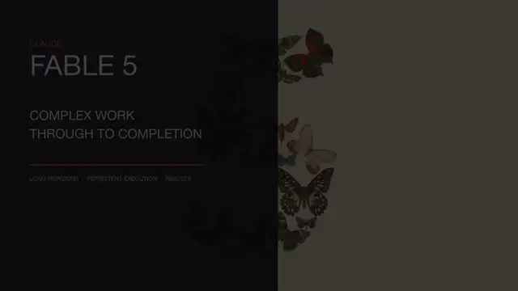

# Case 003 · Claude Fable 5 英文本地化

`对比型` · `语言本地化` · `edit-timeline-studio` · 使用 [Timeline Studio](https://github.com/MartinDelophy/ai-video-editor) 制作 · [English](README.md)

## 1. 原视频

[观看中文原版](../002-claude-fable-5-promo/assets/result.mp4)

## 2. 一句话提示词

> 帮我把 session `019fda2b-a99e-7b90-9a3d-ddf447f603bc` 的内容转换成英文，使用纯英文配音。

## 3. 结果视频

[观看英文结果](assets/result.mp4) · [下载原生可编辑 `.timeline` 工程](assets/claude-fable-5-english.timeline)

Skill 保留了 30.7 秒的原片结构，同时完成画面文字和六段旁白的英文适配。用户发现句尾断音后，Skill 重新构建了带自然收尾缓冲的语音轨，并在最终混音和 Timeline Studio 工程中重新验收。

Session：`019fdac2-76d4-7452-b116-cec82182d8e5`
