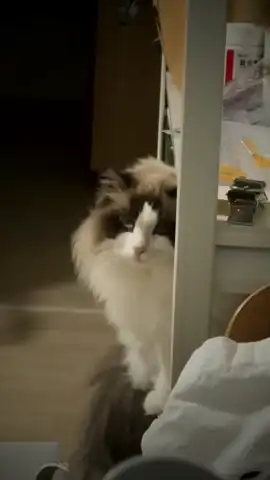

# Case 006 · Cat Highlight Replication

`Comparison` · `edit-timeline-studio` · Built with [Timeline Studio](https://github.com/MartinDelophy/ai-video-editor) · [简体中文](README.zh-CN.md)

## 1. Original

[Watch the original video](assets/reference.mp4)

## 2. One-line prompt

> Use this reference to turn the cat footage into a matching highlight edit: keep the original BGM, remove the final two-second Douyin voice, and recreate its repetition and dramatic tension.

## 3. Result

[Watch the result video](assets/result.mp4) · [Download the editable `.timeline` project](assets/cat-highlight-replication.timeline)

The 11.97-second result rebuilds the reference's tension with 18 editable beats: progressively shorter repeats, monochrome variations, push-ins, white flashes, a secondary peak, a primary peak, and an aftershock ending. It retains the reference BGM while excluding the platform outro and final Douyin voice.

Session: `019fdb28-7f30-7d73-b412-d55583dd1bfe`

Third-party video and music rights remain with their respective owners. This case is a non-commercial skill demonstration.
