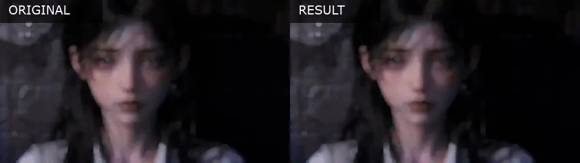

# Case 012 · 15 秒回忆高光重剪

`对比型` · `edit-timeline-studio` · 使用 [Timeline Studio](https://github.com/MartinDelophy/ai-video-editor) 制作 · [English](README.md)

## 1. 原素材

[观看主原视频](assets/reference.mp4)

## 2. 一句话提示词

> 把原素材剪成 15 秒回忆高光：围绕音乐约 1:20 的高潮做多段踩点闪回，中间加入闪白过渡，并把第二段素材的 2:48–2:51 用作最后 3 秒。

## 3. 结果视频

[观看结果视频](assets/result.mp4) · [下载可编辑 `.timeline` 工程](assets/memory-highlight-recut.timeline)

最终 15.00 秒成片把主原视频压缩为 8 个短促回忆片段，再按要求用第二段素材中的拥抱画面替换 12.00–15.00 秒。所有源视频原声均静音；独立音乐只使用其 80.50–95.50 秒高光。中点以短暂闪白完成转折，最后 0.70 秒干净淡黑收束。1906×1080、29 fps 的 H.264/AAC 成片与包含 9 个画面片段的工程均通过完整解码和归档检查。

发布版 `.timeline` 仅去除了重复归档的相同源媒体字节，所有剪辑 ID、源时间区间、音乐素材和编辑决定均保持不变。

Session：`01a02866-7693-7721-973f-dc529adbf70b`
