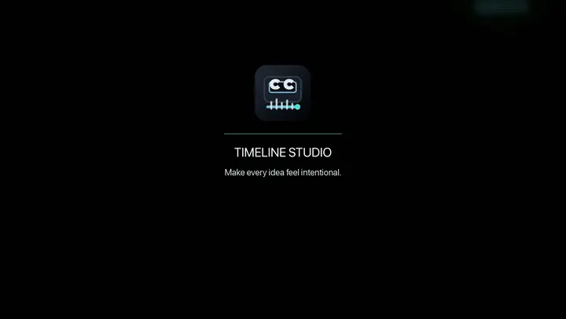

# Case 013 · Timeline Studio Overseas Promo

`Standalone` · `edit-timeline-studio` · Built with [Timeline Studio](https://github.com/MartinDelophy/ai-video-editor) · [简体中文](README.zh-CN.md)

## 1. One-line prompt

> Use the latest `edit-timeline-studio` to create a refined, elegant introduction video for my project, with English voiceover for an overseas audience.

## 2. Result

[Watch the result video](assets/result.mp4) · [Download the editable `.timeline` project](assets/timeline-studio-overseas-promo.timeline)

The 70.07-second English film presents Timeline Studio through nine elegant visual chapters: the browser workspace, controlled multitrack editing, creator and team workflows, local AI tools, voice and music, portable projects, deterministic export, and a restrained closing call to action. Nine separate Heart voice clips form the narration spine with consistent 0.4-second gaps, supported by an original minimalist ambient score. The freshly regenerated 1080p/30 fps H.264/AAC result and its 19-asset project passed full decode, archive, track, and timing validation.

Compatibility note: the original production run restored all visuals, voice clips, music, and the first preview frame in the editor, although the import flow displayed a known post-import `setMusicSegments` warning. The command layer reads the published project without warnings.

Session: `01a04136-36af-7631-afad-28ca3d2e321f`
