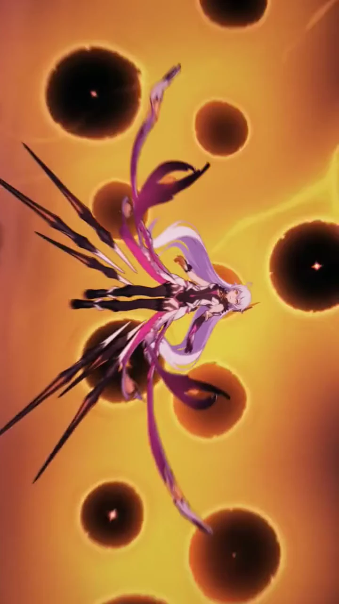

# Case Gallery

English · [简体中文](README.zh-CN.md)

Browse real sessions by skill and capability. Each case includes a visual result, session context, prompt pack, production decisions, verification evidence, and provenance notes.

The gallery also exposes a [machine-readable case index](index.json) for future site generation and filtering.

## All cases

| ID | Preview | Case | Skill | Capabilities |
| --- | --- | --- | --- | --- |
| 001 |  | [Kiana multi-battlesuit reference remake](001-kiana-multi-battlesuit-remake/README.md) | `edit-timeline-studio` | Reference reconstruction, lawful sourcing, multi-source editing, visual QA |

## Browse by capability

- **Reference replication** — [Case 001](001-kiana-multi-battlesuit-remake/README.md)
- **Web footage sourcing** — [Case 001](001-kiana-multi-battlesuit-remake/README.md)
- **Multi-source montage** — [Case 001](001-kiana-multi-battlesuit-remake/README.md)
- **Feedback-driven correction** — [Case 001](001-kiana-multi-battlesuit-remake/README.md)
- **Technical media validation** — [Case 001](001-kiana-multi-battlesuit-remake/README.md)

## Add a session

Copy [`_template`](_template/README.md) into the next numbered directory. Preserve the user's creative brief verbatim, but publish only safe session context. Never publish hidden reasoning, secrets, credentials, private media paths, or personal data.

The production prompt may be created by the skill during the run or synthesized afterward from explicit decisions. Label it clearly; do not present a derived prompt as the user's original words.
